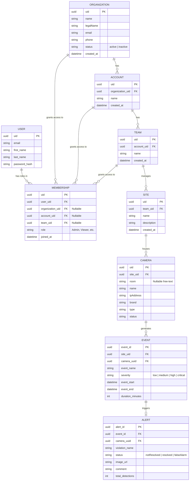

# Somba Web UI: Project Analysis & Backend ERD

## 1. Project Purpose & Domain
**Somba Web UI** is an enterprise-grade Video Management System (VMS) and Physical Security Information Management (PSIM) control plane. It is built using Vue 3, Vite, and TypeScript. 

The application serves two primary layers:
1. **Control Plane (Multi-Tenancy)**: A hierarchy for managing access and infrastructure across `Organizations` -> `Accounts` -> `Teams`. It allows administrators to map physical infrastructure like `Sites` and `Cameras` into logical groups.
2. **Monitoring Center (Live Operations)**: A set of dashboards (`LiveView`, `Events`, `Alerts`, `Recordings`) used by operators to watch live camera feeds, review recorded playbacks, and respond to rule-violation alerts or system events (e.g., motion detection, camera offline).

*(Note: There is also a small subsystem for generic daily reporting (`ReportHarian`), which might be tailored to a specific client use case like school nutrition/logistics tracking).*

---

## 2. How the Endpoints Work (API Mechanics)
The frontend communicates with the backend via a centralized `ApiService` class (wrapping `axios`).

* **Base URL Integration**: The base API URL is driven dynamically by the environment variable `VITE_APP_API_URL`.
* **Authentication & Interceptors**: 
  * The API relies on **JWT (JSON Web Tokens)**.
  * Every request automatically attaches an `Authorization: Bearer <token>` header via Axios interceptors.
  * **Token Refresh**: If the backend returns a `401 Unauthorized`, the `ApiService` catches it, queues any pending active requests, and calls a token refresh endpoint (`auth/refresh`). If the refresh succeeds, the queued requests are retried seamlessly.
* **RESTful Architecture**: The API strictly adheres to REST principles and heavily uses nested routing for hierarchical infrastructure:
  * **Standard CRUD**: `GET /sites`, `POST /report-harian`, `DELETE /recordings/{uid}`.
  * **Nested Resources**: `GET /sites/{siteUid}/cameras`. This implies that infrastructure is scoped tightly to its parent entity.
  * **RPC-like Actions**: For hardware-level commands or state changes, the API uses verb-appended endpoints, such as `POST /cameras/{cameraUid}/start-recording` or `POST /events/{eventUid}/acknowledge`.

---

## 3. Backend Entity Relationship Diagram (ERD)

Based on the backend TypeORM entities and frontend TypeScript interfaces (e.g., `Site`, `Camera`, `Event`, `Organization`, `Member`), here is the database ERD.

---

## 4. Data Models Breakdown

1. **Multi-Tenancy (Org > Account > Team)**: The database employs a strict 3-tier multi-tenant hierarchy. An `Organization` serves as the root corporate tenant, which can be broken down into `Accounts` (e.g., regional branches or sub-companies), which are further subdivided into `Teams` (e.g., specific departments or monitoring shifts).
2. **Membership (RBAC)**: Users do not seem to have global access. Instead, a `Member` bridge table assigns a `User` (email) to a specific tier in the hierarchy (`organization_uid`, `account_uid`, or `team_uid`) along with a specific `role`.
3. **Infrastructure**:
   * **Site**: The physical geographical location monitored by the system. Tied directly to a `Team`.
   * **Camera**: The video edge device. Belongs directly to a `Site`. Optional free-text `room` label (e.g., "Kitchen", "Reception"). Stream endpoints are stored on the camera record (e.g., `ipAddress` / `public_endpoint_url`).
4. **Events & Alerts**: `Cameras` stream telemetry that generate `Events` (e.g., generic system logs, motion detected). High-priority rule violations get escalated into `Alerts`, storing `image_urls`, `total_detections`, and requiring manual operator intervention (updating the status to `resolved` or `falseAlarm` with a `comment`).
