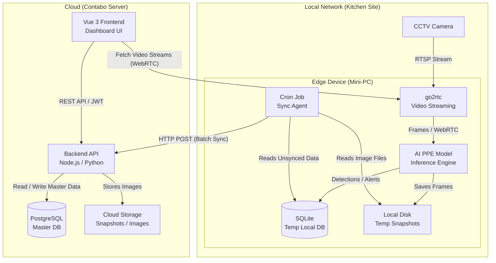

# Kitchen PPE Surveillance System Design

## 1. Overview & Architecture Summary
The Kitchen Personal Protective Equipment (PPE) Surveillance System is designed to monitor compliance and detect violations (e.g., missing hairnets, gloves, masks) in real-time. To optimize bandwidth and ensure low latency, the system utilizes a **Hybrid Edge-Cloud Architecture**.

*   **Edge (Local Mini-PC):** Handles heavy video streaming, frame extraction, and AI inference locally. It caches detection logs and snapshots temporarily.
*   **Cloud (Contabo Server):** Serves as the central control plane and long-term storage. It manages master data (multi-tenancy, RBAC, hardware mapping) and serves the frontend dashboard for administrators and operators.

---

## 2. High-Level Architecture Diagram

---

## 3. Edge Architecture (Mini-PC)

The Edge layer is deployed physically at the kitchen site on the same local area network (LAN) as the CCTV cameras to avoid high bandwidth costs of streaming raw video to the cloud.

### Components:
1.  **go2rtc:** 
    *   Acts as a robust camera stream router.
    *   Pulls RTSP/ONVIF streams directly from local CCTVs.
    *   Provides ultra-low latency WebRTC/MSE streams to the local AI model (and directly to the cloud dashboard if real-time live-view is required by operators).
2.  **AI Inference Engine:**
    *   Consumes frames from the local stream.
    *   Runs computer vision models (e.g., YOLOv8, custom PPE classifiers) to detect people, faces, and PPE compliance.
    *   Generates *Events* (normal logging) and *Alerts* (PPE violations).
3.  **Local Storage (SQLite & File System):**
    *   **SQLite DB:** Stores detection metadata (timestamp, camera ID, violation type, confidence score) tagged with a `sync_status = false` flag. SQLite is lightweight, file-based, and perfect for the edge.
    *   **File System:** Stores the physical snapshot (JPEG/PNG) of the exact frame where the violation occurred.
4.  **Sync Agent (Cron Job):**
    *   A scheduled script (e.g., Python or bash) that runs periodically (e.g., every 1-5 minutes).
    *   Queries SQLite for all records where `sync_status = false`.
    *   Packages the metadata and local image files, then sends a secure HTTPS request to the Cloud API.
    *   Upon successful 200 OK from the cloud, updates local SQLite records to `sync_status = true` (and periodically purges old synced data to save disk space).

---

## 4. Cloud Architecture (Contabo Server)

The Cloud layer acts as the centralized management platform, handling everything outside of the raw video processing.

### Components:
1.  **Backend API:**
    *   Handles incoming batch syncs from all connected Mini-PCs across various sites.
    *   Manages the Master Data (Organizations, Accounts, Teams, Sites, Cameras, Users, and RBAC).
    *   Serves paginated detection logs, analytics, and master data to the Frontend.
2.  **PostgreSQL Database:**
    *   Relational database to handle complex multi-tenant relationships (as outlined in the `PROJECT_ANALYSIS_AND_ERD.md`).
    *   Stores permanent records of all `Events` and `Alerts` uploaded from the Edge.
3.  **Object Storage (File System / S3-compatible):**
    *   Receives and permanently stores the snapshot images of PPE violations uploaded by the Mini-PCs.
    *   Provides secure, publicly/privately accessible URLs for the Frontend to display.
4.  **Frontend (Vue 3 / Vite):**
    *   The Web UI for administrators and monitoring center operators.
    *   Displays analytical dashboards, historical event logs, alert resolution workflows, and camera management settings.

---

## 5. Data Sync Mechanism (Edge to Cloud)

To ensure data integrity, especially if the kitchen experiences an internet outage, an asynchronous sync strategy is used:

1.  **Inference:** AI Model detects no-hairnet -> Saves `image_123.jpg` to local disk -> Inserts row into local SQLite `Alerts` table (`sync_status=0`).
2.  **Cron Trigger:** Runs every 1 minute.
3.  **Batching:** Selects up to 100 unsynced alerts.
4.  **Transmission:** Makes a `multipart/form-data` POST request to the Contabo Server API containing JSON metadata and the image files.
5.  **Cloud Reception:** Contabo Backend saves images to disk/S3, saves records to PostgreSQL, and returns `[ { "id": 1, "status": "success" } ]`.
6.  **Local Acknowledgment:** Cron script reads the response, updates SQLite (`sync_status=1`), and deletes the local image file to free up the Mini-PC's storage.

---

## 6. Live View Streaming Strategy (Bonus)
Since the Contabo server does not handle raw video, how does the user view live CCTV feeds on the Frontend?
*   **Direct WebRTC via go2rtc:** The Vue frontend, when loaded by an operator, communicates directly with the edge `go2rtc` instance. 
*   *Requirement:* The Mini-PC must expose the go2rtc WebRTC port (e.g., 8555) securely (via Reverse Proxy, Tailscale, Cloudflare Tunnels, or port forwarding) so the frontend client browser can establish a peer-to-peer connection for ultra-low latency live viewing without overwhelming the Contabo server.

---

## 7. Tech Stack Summary

| Layer | Component | Technology / Tool |
| :--- | :--- | :--- |
| **Edge** | Video Router | go2rtc |
| **Edge** | Inference | Python, YOLO / OpenCV / Custom PyTorch model |
| **Edge** | Temp Database | SQLite |
| **Edge** | Sync Mechanism | Cron, Python Requests / cURL |
| **Cloud** | Web Server | Nginx / Traefik (Reverse Proxy) |
| **Cloud** | Backend API | Node.js (Express/Nest) or Python (FastAPI) |
| **Cloud** | Master Database| PostgreSQL |
| **Cloud** | Image Storage | Local Disk / MinIO / AWS S3 |
| **Frontend**| Web App | Vue 3, Vite, TypeScript, Pinia |
